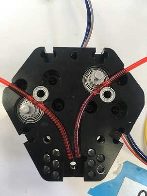

# Loading and Unloading Filament

## **Loading and unloading Filament:**


Warning before loading:

Verify that wiring between the Duet 2 Maestro and the M3D Crane \(including wiring to the QuadFusion and other printer components\) is correct.Verify that the Duet 2 Maestro firmware is updated to the most recent version. You can find version 2.O2 release candidate [here](https://github.com/dc42/RepRapFirmware/releases/download/2.02RC2/DuetMaestroFirmware.bin).In addition you can find the latest version of Duet Web Control [here](https://github.com/dc42/RepRapFirmware/releases/download/2.02RC2/DuetWebControl-1.22.3.zip).Be sure to double check that the cold section fan 1 is running at full power. \(This is needed for long term heatbreak cooling\)


## Pre-loading Process

* Start by cutting your filament flush. You should start with 4 new strands. **\(poorly cut filament may damage PTFE or bind up in the curved path\)**
* Observe port labeling 0-3 and select extruder drive 0 \(If unlabeled, they are in left to right order and the left most will be extruder drive 0\) or if your Quad is labeled from 1 to 4, simply swap the 0 for 1 and proceed as directed. 
* Select a feed rate of 5 mm/s \(any faster and it may shred the filament or cause the motor to skip\)
* Select a 10 mm filament feed amount


**Be sure to set the temperature to 170C** **Not doing this will cause backflow up the nozzles chambers that will block future loadings!**


## **Loading Sequence for Duet Web Control** 

1. Insert your chosen filament in to each port and hold it at a curved angle and apply some pressure so the filament remains in it's port once you let go. \(Use the natural curve of the filament to match the curves shown below to minimize any risk of missing the curve path\)

   

2. Once each port has it's respective filament in the loading position start the extrusion sequence as follows: Port 0: 23mm  Port 1: 28mm   Port 2: 28mm   Port 3: 23mm
3. Once each filament has moved down through the print head to the Staging area, directly above the PTFE insert, set the feed amount to 20mm and then Extrude ALL. 
4. Select Extrude ALL again
5. Select Extrude ALL again and at this point filament should start to extrude through the nozzle. 

If you experience ANY stalling at ANY stage of the filament loading process it is advisable to STOP, retract and try again until you can complete all of the steps without any interruption. Should you experience persistent stalling during any step of the loading process please scroll down and refer to the section titled "Stalling during the loading process" for further instruction. 


Note: If your Quad print head is not labeled from port 0 to 3, but instead is labeled from 1 to 4 simply swap the 0 for 1 and proceed with the loading sequence as directed.   


IMPORTANT: Should you experience ANY stalling during any of the steps above, it is advised that you simply follow the steps to **retract** each filament and start the process over until you are able to move through each step without interruption. 

## Stalling during the loading process:

Should you experience frequent stalls during this process refer to the below information to determine exactly when and where the stalls are occurring:  

 Stall during STEP 2, it is occurring in the Quad's block, or filament path.

Stall in STEP 3, it is occurring at the PTFE entrance or within the PTFE insert it's self.

 Stall in STEP 4, it is occurring at the Metal Insert entrance or within the metal insert.

Stall in STEP 5, it is occurring after the metal insert, toward the nozzle tip.

Once you have determined the most likely location of the source of the stalling, you will then be able to clear any blockages and resume your loading sequence. 

## Extrusion: 

* Set the temp to 240C \(nozzle may ooze ignore it\)
* Change settings to extrude all at 15mm/s and leave the extrude amount at 20mm.
* Confirm your temperature is still set to 240C.
* Hit extrude \(Waiting between steps\) until filament comes out at a steady speed.
* Be sure that no motors are skipping 

## Unloading: 

* Set Nozzle Temperature to 170C.
* Change setting to Extrude All, Extrude at 15mm/s and set the extrusion amount at 100mm
* Press retract 3 times
* The machine may now be turned off


Turning Off your machine: ****There are no special considerations for turning off your QuadFusion. However, keep in mind that filament should not be above temperature without motion for longer than 5 minutes, with the exception of PETG; which can handle being held at temperature in the QuadFusion for at least one day. PLA readily degrades.


## Operating Notes:

While you DO need to use your CMYK filament in order to produce the color mixes it is NOT necessary when you're just wishing to do single color prints. In order to operate your Crane Quad printer with any less than 4 filaments you will need to have at least 30 mm of filament loaded into each of the unused ports. 

The Crane Quad is designed as a 4 filament, color mixing print head. It needs filament in each of it's ports to prevent back flow. This does not mean that  you can not use the Crane Quad for single color or single filament prints. Simply adjust your setting appropriately when you slice your model, and make sure your Quad print head is loaded properly in that there is filament in all 4 ports, regardless if  you intend to utilize each of them or not. 

