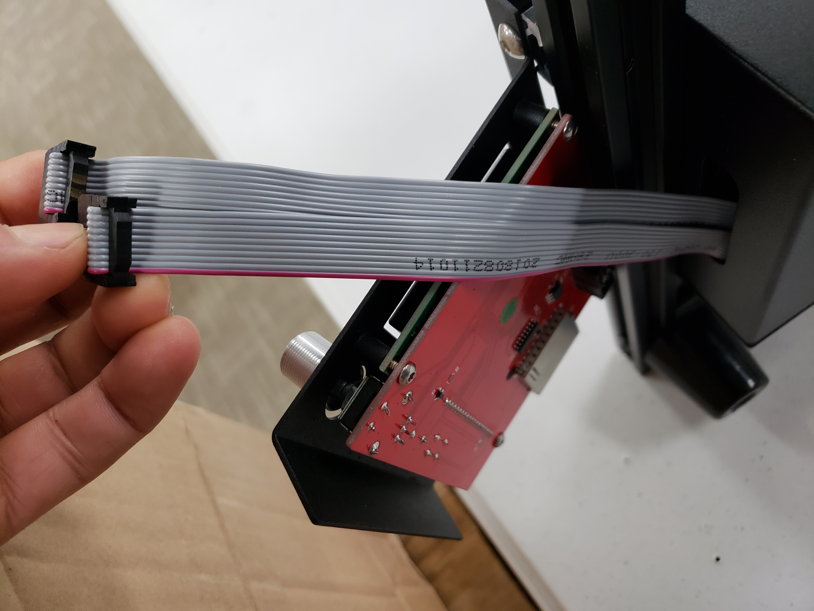
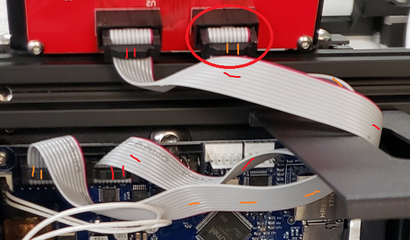
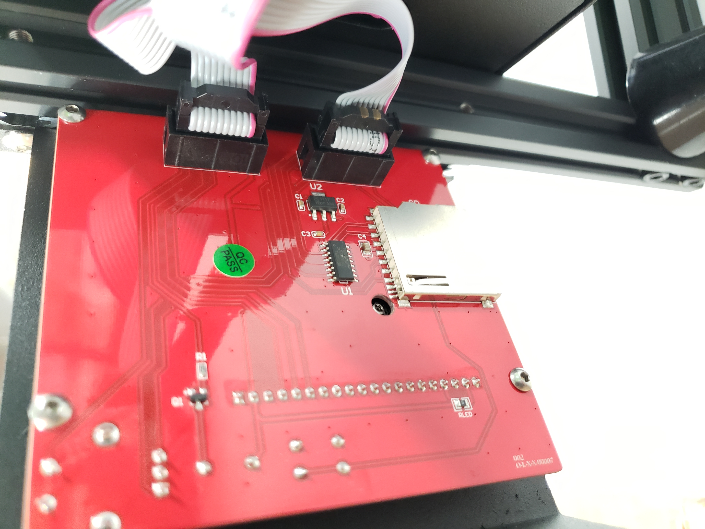
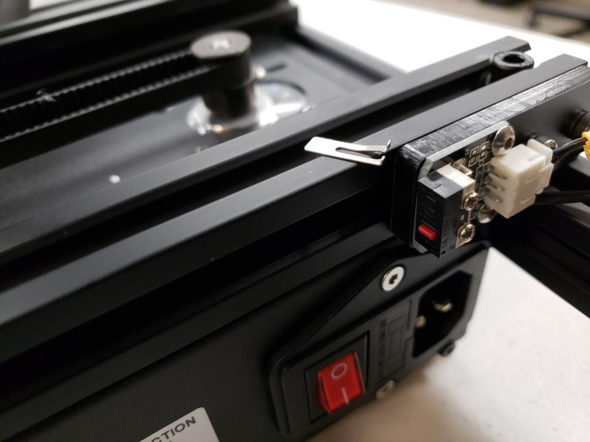

# Unboxing and Assembly


The M3D Crane Quad contains sensitive electronics, delicate mechanical parts, and an electrical heating system. Please exercise all applicable safety precautions and follow this guide closely to avoid damage to your M3D Crane Quad, to avoid injury to yourself or others, and insure proper operation.

Check your Local Supply Voltage and set your printers Voltage accordingly, or risk damage to your printer. 


## Setting up after unboxing your printer: 

After removing your M3D Crane Quad from the box, remove all the plastic wrapping being careful not to cut any of the sensitive parts of the device, such as the cables. Your M3D Crane Quad should look like this:

Remove the bolts at the bottom of each upright rail, as shown below. Setting them aside briefly:


Inspect your M3D Crane Quad for any damage that may have occurred during shipping. Every precaution has been made to prevent this, however it is advisable to give all the components a thorough inspection before operation. If any issues are discovered, document the damage by taking an image of the affected area and contact M3D immediately.


 As long as no issues are discovered, you are ready for mechanical assembly. 

## Assembly: 

Being careful not to stress or pull any of the cables, have a friend assist you in raising the upright rails; be sure to **align the bolt holes**.

If you aren't able to hold the upright in place, get someone's help to steady it. Line up the bolt holes \(that previously housed the bolts you removed\) and begin slowly tightening the bolts; first hand tighten, then slowly tighten more firmly with the provided **Allen Key**.

Ensure that all motor cables are connected. These are part of the **black ribbon cable**. You can identify the correct motor cable by looking at the **yellow tags reading 'X, Y, and Z'.** The motor connections are made up of 4 wires, while the associated endstop cable is a three wire cable directly beside the 4-wire cable for the respective motor; the only motor without an endstop is the extruder.

Connect the two gray ribbon cables labeled '1' and '2' and connect them to their respective ports on the back of the LCD assembly, 'EXP1' and 'EXP2'. **Be careful not to cross these connections as it may damage the LCD Screen.**

Should you find that your LCD cables are not labeled, simply determine which cable is **shortest**, that will be the cable to be connected to **EXP1**. 

Connect the **short cable to EXP1**, plug the **longer** **cable into EXP2**, and proceed to the next step. 

After making the connections, use the provided bolts and Allen Key to secure the LCD to the front of the M3D Crane Quad.

## Z-endstop positioning:

Be sure your M3D Crane is powered off and/or unplugged before you begin this step. 

In order to ensure nothing is damaged during shipping, and furthermore during the first power on of your M3D Crane, it's been shipped with the Z-endstop raised. You will need to manually lower your Z-endstop before printing. 

The first step to moving your Z-endstop to an appropriate height is to examine the exposed bolts below the Y-carriage and to tighten/loosen all four of your bed nuts so that only about 8-10 threads are exposed on each.  You can see in this photograph a bolt that has been tightened to its recommended position. Use your own 7mm or 1/4th inch wrench to ensure each bolt is adjusted to approximately the same position.

Next you will need to manually center the print head over the bed. To do this gently move the print head left-to-right along the X-axis until it's in the center. Then, move the bed forward along the Y-axis until its center.  At this point, the print head should be above the center of the bed.  Finally, rotate the coupler between the Z-motor and the Z-leadscrew counter-clockwise until the left bracket of the X-axis is resting on top of the Z-endstop switch as seen in the photo.

The Z endstop is attached to the rail with two T-nuts that hang the inside of the aluminum extrusion channel.  Loosen the Z endstop bracket enough to loosen the 2 screws that secure the bracket to the rail. 

After loosening the Z-endstop and allowing it to move down, we are now free to move the printhead closer to the bed.  Slowly lower the print head until the nozzle touches the bed. 

Little by little raise the Z endstop until a click is heard/felt and then tighten down the 2 screws again. You should be able to secure one of the nuts fairly easily to maintain the position of the Z endstop.

Manually raise your print head by rotating the Z axis and now you are ready to power on the M3D Crane  and select Home All in the LCD menu. While it is still necessary that we run through the leveling process with the printer powered on, making these changes ensures that we do not cause any damage to the print surface.  

In order to assure your M3D Crane Series printer maintains an accurate bed level after following the [Bed Leveling](https://crane.printm3d.com/~/edit/drafts/-LTi556ASBKSVfOwPujM/crane-bowden-guide/manual-bed-leveling) section of this guide it may be necessary to make further adjustments to the Z endstop position. Maneuvering the Z endstop in conjunction with following the Bed Leveling guide will lead to a more accurate and level print bed.  

## Spool Holder:

The M3D Crane Quad includes 2 spool holders. One is a 3D printed Spool Holder, designed to hold the 4 smaller spools of 3DInk Filament necessary to take full advantage of it's color mixing capabilities and the other Spool Holder included is better suited to hold the larger spools of 3DInk Filament. Here we show how to assemble the larger of the spool holders. 

The Spool Holder is comprised of the following parts:

* 2 T-nuts
* Mounting Bracket
* Spool Mount Spindle
* 2 End Caps

To assemble the Spool Holder screw the T-nuts into the holes at the bottom of the Mounting Bracket. Be sure to leave them fairly loose as you will tighten them firmly once the Mounting Bracket has been attached to the top rail of your M3D Crane Quad printer. 

Once the T-nuts are in place, slip one end of the Spool Mount Spindle through the large hole in the top of the Mounting Bracket and secure with an End Cap. 

The Spool Holder is designed so that the End Cap secures the spool and prevents it from slipping off the Spool Mount Spindle while in use. When not in use it's advised to keep the End Cap secured to the Spool Mount Spindle to prevent it from becoming lost or misplaced. 

Once your Spool Holder is fully assembled simply slip the T-nuts into the grove on the top rail of your M3D Crane Quad printer and tighten securely.

## Endstop Damage:


Occasionally things can be damaged during shipping, and or come loose. If you notice that one of your end-stops has broken, you can swap any of the others to replace the Z end-stop as this one is the most important.  


## Before powering on your M3D Crane Series Printer:

You should have received along with your printer, a micro SD card as well as a blue micro SD card adapter. Check the SD card slot on the right side of your Crane Series printer to see if yours was shipped with the SD card already in place. If your SD card is already in place, remove it and replace it before powering it on. The SD card may have been shifted or impacted during shipping and turning on the power with the SD card askew inside could lead to damage.  

If your SD card has arrived in a small separate case, simply remove the SD card from it's package and place it into the SD card slot on the right side of your Crane Series printer. 

The Crane Series of printers are unique in that they are built with a Duet Maestro board. The Duet board uses the information on the SD card to operate, in a sense the SD card that goes in the slot on the Duet acts like it's hard drive. It is for this reason that should you desire to use an SD card to move your gcode to your printer instead of using Duet Web Control, it's recommended to purchase a second micro SD card and use the SD card slot on the back of the LCD screen.

## QuadFusion Print Head: Replacing the Nozzle

Upon shipping your M3D Crane Quad's QuadFusion print head will be fully assembled. Should you wish to replace the nozzle, or should you have taken apart the print head for any reason, follow this Video Guide closely in order to correctly re-assemble your QuadFusion print head. 




Pay close attention to the Rotational Alignment of the Nozzle upon re-assembly. 


## Additional information:

After assembly you may have some questions that might be further discussed in our[ Pro Tuning Guide](https://crane.printm3d.com/advanced-tuning-m3d-crane-series/tuning-guide).

Once your M3D Crane Quad is complete it should look like this:

Congratulations on completing the assembly of your M3D Crane Quad printer!! Please continue on to the next section where you will learn how to add your M3D Crane Quad to your existing network, or set up a network from scratch.   


Prior to exiting this section, please double check all connections, and place your  M3D Crane Quad on a flat surface. Ensure the Power Switch is Off\(O\), double check that your voltage is set appropriately for YOUR area\(consult local authorities if you are unsure\). **Failure to do this can irreparably harm the electronics in your printer.**


